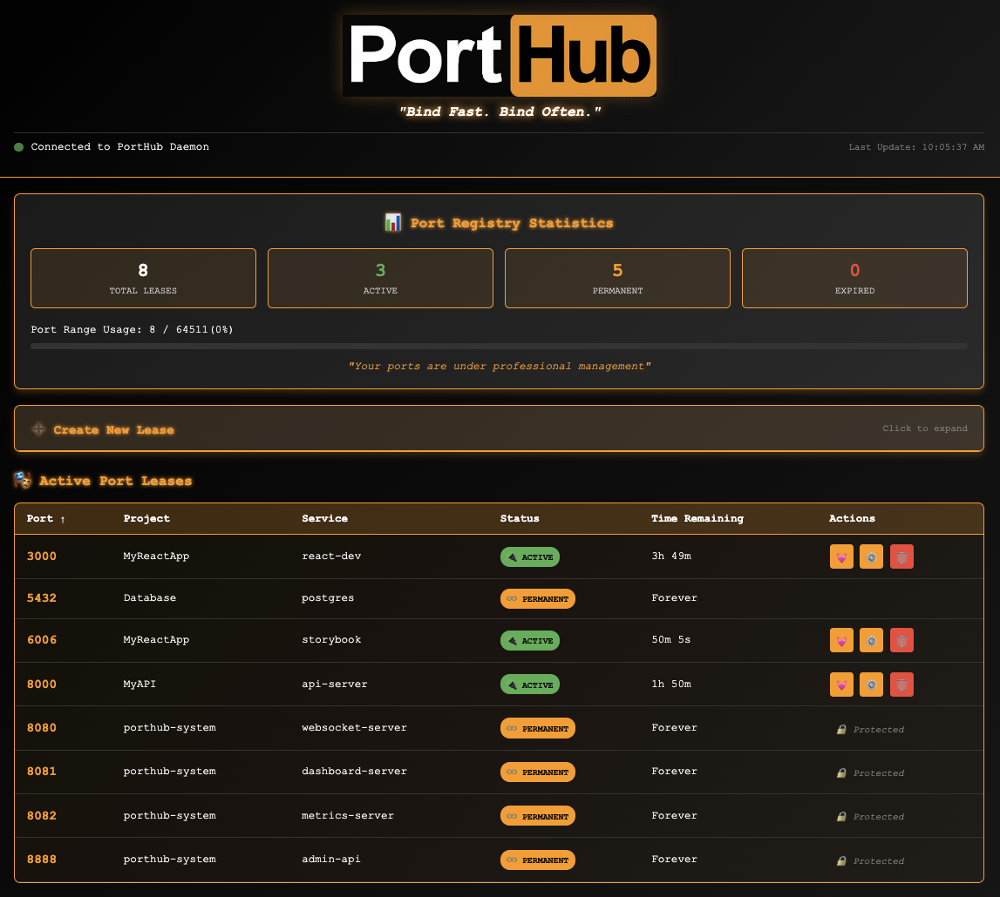
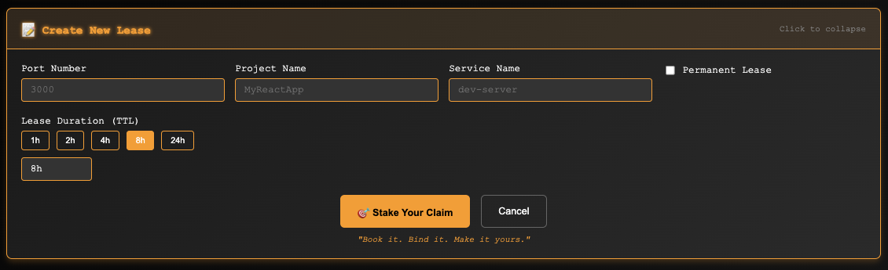
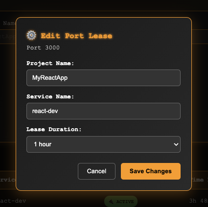

<div align="center">
  
</div>

# PortHub - DHCP for Developers

**"No Conflicts. Just Connections."** 🎭

## 🎯 What is PortHub?

PortHub is a **professional port registry** that manages development ports like a DHCP server. It prevents "port already in use" errors by intelligently tracking, leasing, and managing ports across all your development projects.

### 🚨 Problem It Solves
- **Port Conflicts**: No more "EADDRINUSE" or "address already in use" errors when starting multiple projects
- **React/Next.js Development**: Seamlessly run multiple React, Next.js, and Node.js projects simultaneously 
- **Database Management**: Permanent port leases for PostgreSQL, MySQL, MongoDB, Redis
- **AI Assistant Integration**: Designed for Cursor, VS Code, and other AI-powered development tools
- **Project Chaos**: Know which project owns which ports across your entire development environment
- **Manual Tracking**: Stop manually remembering which ports are free
- **Abandoned Ports**: Automatic cleanup of forgotten development servers with TTL expiration

### ✨ How It Works
1. **Request a Port**: PortHub assigns and tracks it with a lease (like DHCP)
2. **Time-to-Live (TTL)**: Ports automatically expire and get freed
3. **Real-Time Dashboard**: Monitor all active leases via web interface
4. **Smart Conflicts**: Get suggested alternatives when ports are busy
5. **Permanent Infrastructure**: Databases and core services stay registered

### 🎭 Web Dashboard
PortHub includes a real-time web dashboard for visual port management:


*Real-time port lease monitoring with WebSocket updates*


*Easy lease creation with project and service autocomplete*


*Manage existing leases with TTL adjustments and Forever easter eggs*

## 🎯 Common Use Cases

### **Frontend Development**
- **React Development**: `porthub lease 3000 --service "react-dev" --ttl 8h`
- **Next.js Projects**: Automatic port management for dev server and API routes
- **Vite Applications**: Conflict-free development with HMR support
- **Storybook**: Isolated component development without port conflicts

### **Full-Stack Development** 
- **Node.js APIs**: Express, Fastify, NestJS server management
- **Database Services**: PostgreSQL (5432), MySQL (3306), MongoDB (27017), Redis (6379)
- **Microservices**: Run multiple services simultaneously without conflicts
- **Docker Development**: Container port mapping coordination

### **AI Assistant Workflows**
- **Cursor Integration**: AI assistants automatically manage ports during development
- **VS Code Automation**: Programmatic port leasing for development tasks
- **GitHub Copilot**: Enhanced development workflow with intelligent port management
- **Automated Testing**: CI/CD pipelines with conflict-free port allocation

### **Team Development**
- **Multi-Developer**: Prevent port conflicts across team members
- **Project Switching**: Seamless context switching between different projects
- **Infrastructure Management**: Shared database and service port coordination

## 🚀 Quick Start

> **⚠️ Alpha Release:** PortHub is currently in alpha. Core functionality works great, but expect some rough edges. Perfect for early adopters and feedback!

### 1. Install & Start Daemon
```bash
npm install -g @porthub/porthub@alpha
porthub start --daemon --port 8080
```

### 2. Lease Ports for Your Projects
```bash
# Temporary lease for development
porthub lease 3000 --project "MyReactApp" --service "dev-server" --ttl 4h

# Permanent lease for infrastructure  
porthub lease 5432 --service "postgres" --permanent
```

### 3. Check Status
```bash
porthub status
```

## 🎯 Core Concepts

### Port Leasing (Like DHCP)
- **Request a port**: PortHub assigns and tracks it
- **TTL (Time-To-Live)**: Ports auto-expire and get freed
- **Conflict Resolution**: Suggests alternative ports when conflicts occur
- **Heartbeat**: Extend leases for active services

### Permanent vs Temporary Leases
- **Temporary**: Perfect for development servers (expire automatically)
- **Permanent**: Perfect for databases, caches, core services (never expire)

## 📋 Complete Command Reference

### Core Commands

| Command | Description | Example |
|---------|-------------|---------|
| `porthub start --daemon` | Start PortHub DHCP daemon | `porthub start --daemon --port 8080` |
| `porthub lease <port>` | Request port lease | `porthub lease 3000 --ttl 2h` |
| `porthub lease <port> --permanent` | Create permanent lease | `porthub lease 5432 --service postgres --permanent` |
| `porthub release <port>` | Release port lease | `porthub release 3000` |
| `porthub status` | Show all active leases | `porthub status --json` |
| `porthub heartbeat <port>` | Extend lease TTL | `porthub heartbeat 3000` |
| `porthub start sneakysniffer` | Scan system ports | `porthub start sneakysniffer --dirty` |
| `porthub discover` | Discover workspaces across system | `porthub discover` |
| `porthub discover --register` | **Register PortHub infrastructure ports** | **`porthub discover --register`** |

### Lease Options

| Option | Description | Example |
|--------|-------------|---------|
| `--project <name>` | Project name (auto-detected from git/package.json) | `--project "MyReactApp"` |
| `--service <name>` | Service name | `--service "dev-server"` |
| `--ttl <duration>` | Lease duration | `--ttl 2h`, `--ttl 30m`, `--ttl permanent` |
| `--permanent` | Create permanent lease | `--permanent` |
| `--auto-renew` | Enable automatic renewal | `--auto-renew` |
| `--description <desc>` | Port description | `--description "React dev server"` |

### TTL Formats
- `30s` - 30 seconds
- `15m` - 15 minutes  
- `2h` - 2 hours
- `1d` - 1 day
- `1w` - 1 week
- `permanent` - Never expires

## 🎭 Real-World Workflows

### Perfect Multi-Project Setup

```bash
# 1. Start PortHub daemon (once)
porthub start --daemon --port 8080

# 2. Set up permanent infrastructure (one time)
porthub lease 5432 --service "postgres" --permanent     # Database
porthub lease 6379 --service "redis" --permanent        # Cache  
porthub lease 8000 --service "admin-api" --permanent    # Admin API

# 3. Project-specific development (daily)
cd ~/projects/MyReactApp
porthub lease 3000 --service "dev-server" --ttl 8h      # Full work day
porthub lease 6006 --service "storybook" --ttl 2h       # Quick testing

cd ~/projects/MyAPIServer  
porthub lease 4000 --service "api-server" --ttl 6h      # API development

cd ~/projects/MobileApp
porthub lease 8081 --service "expo-dev" --ttl 4h        # Mobile dev

# 4. Check everything
porthub status
```

### Sample Status Output
```
📊 PortHub Lease Status
━━━━━━━━━━━━━━━━━━━━━━━━━━━━━━━━━━━━━━━━━━━━━━━━━━━━━━━━━━━━━━━━━━━━━━━━━━━━━━━━

📈 Active Leases: 6

🍆 Active Port Leases:
   ♾️  Port 5432 - Database/postgres
      PERMANENT
   ♾️  Port 6379 - Cache/redis
      PERMANENT  
   ♾️  Port 8000 - Admin/admin-api
      PERMANENT
   🔌 Port 3000 - MyReactApp/dev-server
      Expires in 7h 23m (tonight at 11:30 PM)
   🔌 Port 6006 - MyReactApp/storybook
      Expires in 1h 45m (today at 7:15 PM)
   🔌 Port 4000 - MyAPIServer/api-server
      Expires in 5h 12m (tonight at 10:45 PM)
```

### Conflict Resolution
```bash
porthub lease 3000 --service "new-project"
# ⚠️  Port 3000 conflicts with MyReactApp/dev-server
# 🎯 Suggested alternative: Port 3002 available
# 💡 Run: porthub lease 3002 --service "new-project"

porthub lease 3002 --service "new-project" --ttl 2h
# ✅ Port 3002 leased successfully!
```

## 🔧 Integration Examples

## 🌟 Multi-Workspace Support

PortHub automatically discovers workspace configurations across your development environment:

### Workspace Discovery
```bash
# Discover all PortHub workspaces on your system
porthub discover

# Register PortHub's own infrastructure ports permanently
porthub discover --register
```

### Cross-Project Port Management
- **Automatic Configuration Detection**: Finds `porthub.json` files across common project directories
- **Multi-Workspace Visibility**: See port usage across all your development projects
- **Infrastructure Port Registration**: Permanent leases for system services (databases, PortHub itself)
- **Conflict Prevention**: DHCP-style port management prevents collisions between projects

### Workspace Configuration Locations
PortHub searches these directories for workspace configurations:
- Current working directory (highest priority)
- `~/Documents/Projects/`
- `~/Documents/GitHub/`
- `~/Projects/`
- `~/Code/`
- User home directory
- `~/.config/porthub/`

### Package.json Integration
```json
{
  "scripts": {
    "dev": "porthub lease 3000 --service dev-server --ttl 4h && next dev && porthub release 3000",
    "storybook": "porthub lease 6006 --service storybook --ttl 2h && storybook dev -p 6006 && porthub release 6006",
    "server": "porthub lease 8080 --service api-server --ttl 6h && node server.js && porthub release 8080",
    
    "porthub:status": "porthub status",
    "porthub:scan": "porthub start sneakysniffer",
    "porthub:heartbeat": "porthub heartbeat 3000"
  }
}
```

### Auto-Start Daemon (Shell Profile)
Add to `~/.zshrc` or `~/.bashrc`:
```bash
# Auto-start PortHub daemon on shell startup
if ! pgrep -f "porthub.*daemon" > /dev/null; then
  porthub start --daemon --port 8080 >/dev/null 2>&1 &
  echo "🎭 PortHub daemon started"
fi
```

### VS Code Tasks Integration
Add to `.vscode/tasks.json`:
```json
{
  "version": "2.0.0",
  "tasks": [
    {
      "label": "Start Dev Server with PortHub",
      "type": "shell",
      "command": "porthub lease 3000 --service dev-server --ttl 4h && npm run dev",
      "group": "build",
      "presentation": {
        "reveal": "always",
        "panel": "new"
      }
    },
    {
      "label": "PortHub Status",
      "type": "shell", 
      "command": "porthub status",
      "group": "test"
    }
  ]
}
```

## 🧠 For AI Assistants

### Auto-Registration Pattern
When helping users with development:

1. **Always start daemon first**: `porthub start --daemon --port 8080`
2. **Lease before running servers**: `porthub lease {PORT} --service {SERVICE} --ttl {DURATION}`
3. **Use permanent for infrastructure**: `porthub lease 5432 --service postgres --permanent`
4. **Release when done**: `porthub release {PORT}`
5. **Check status frequently**: `porthub status`

### Common Service Patterns
```bash
# Frontend Development
porthub lease 3000 --service "react-dev" --ttl 4h      # React/Next.js
porthub lease 5173 --service "vite-dev" --ttl 4h       # Vite
porthub lease 6006 --service "storybook" --ttl 2h      # Storybook

# Backend Development  
porthub lease 8080 --service "api-server" --ttl 6h     # Express/Node
porthub lease 4000 --service "fastify" --ttl 4h        # Fastify
porthub lease 9000 --service "graphql" --ttl 4h        # GraphQL

# Databases (Permanent)
porthub lease 5432 --service "postgres" --permanent    # PostgreSQL
porthub lease 3306 --service "mysql" --permanent       # MySQL
porthub lease 27017 --service "mongodb" --permanent    # MongoDB
porthub lease 6379 --service "redis" --permanent       # Redis

# Development Tools
porthub lease 8081 --service "expo-dev" --ttl 4h       # Expo
porthub lease 3001 --service "webpack-dev" --ttl 4h    # Webpack Dev Server
porthub lease 7000 --service "electron" --ttl 2h       # Electron
```

## 🎯 Benefits

✅ **Zero Port Conflicts**: DHCP-style management prevents collisions  
✅ **Project Awareness**: Knows which project owns which ports  
✅ **Automatic Cleanup**: TTL ensures abandoned ports are freed  
✅ **Multi-Project Support**: Run many projects simultaneously  
✅ **Infrastructure Management**: Permanent leases for databases/services  
✅ **Cursor Integration**: Seamless workflow in your IDE  
✅ **Real-Time Monitoring**: WebSocket updates and status dashboard  
✅ **Conflict Resolution**: Smart suggestions for alternative ports  
✅ **Cross-Platform**: macOS, Linux, Windows support  

## 🏗️ Architecture

- **CLI**: Command-line interface with PortHub personality
- **Daemon**: Background service managing port registry
- **Registry**: In-memory port lease database with TTL management  
- **IPC**: Inter-process communication between CLI and daemon
- **WebSocket**: Real-time updates and monitoring
- **SneakySniffer**: Port scanning utility for system discovery

## 🎭 PortHub Personality

PortHub embraces its snarky, sleazy-tech personality while maintaining professional functionality:

- **Error Messages**: *"Port already claimed, you greedy bastard"*
- **Success Messages**: *"Your port is now officially yours, you magnificent beast"*
- **Status Updates**: *"Your ports are now under professional management"*
- **CLI Taglines**: *"The Protocol Registry That Parties Responsibly"*

## 📚 Documentation

- **Global Cursor Rules Template**: `src/templates/global-cursor-rules.md`
- **Project File Reference**: `PROJECT_FILE_REFERENCE.md`
- **Technical Specifications**: `technical-specifications.json`
- **Development Roadmap**: `ROADMAP.md` (internal)

## 🚀 Installation & Setup

### Global Installation
```bash
# Alpha release (current)
npm install -g @porthub/porthub@alpha

# Stable release (coming soon)
npm install -g @porthub/porthub
```

### Verify Installation
```bash
porthub --version
porthub --help
```

### Start Daemon
```bash
porthub start --daemon --port 8080
```

### Test System
```bash
porthub start sneakysniffer --dirty
porthub lease 3000 --service "test" --ttl 5m
porthub status
porthub release 3000
```

---

**"Get it up. Get it bound. Stay registered."** - PortHub Development Philosophy

Made with 🎭 by the PortHub team
